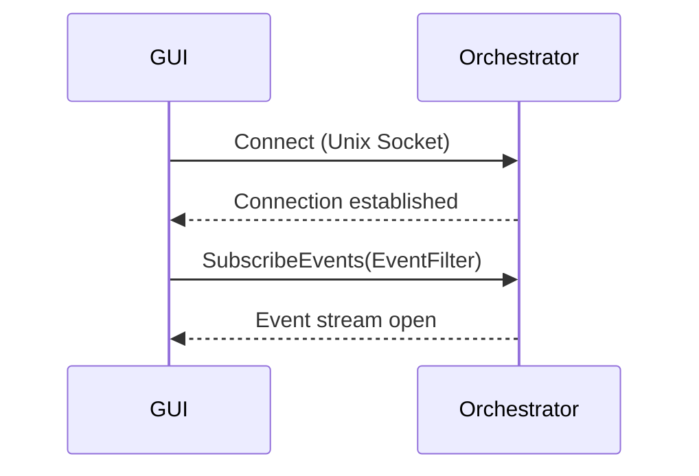
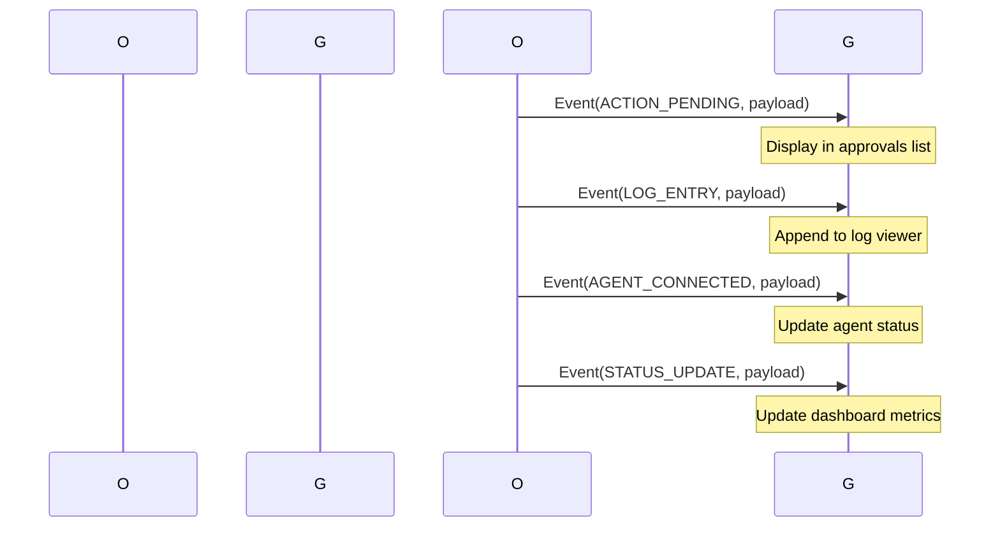
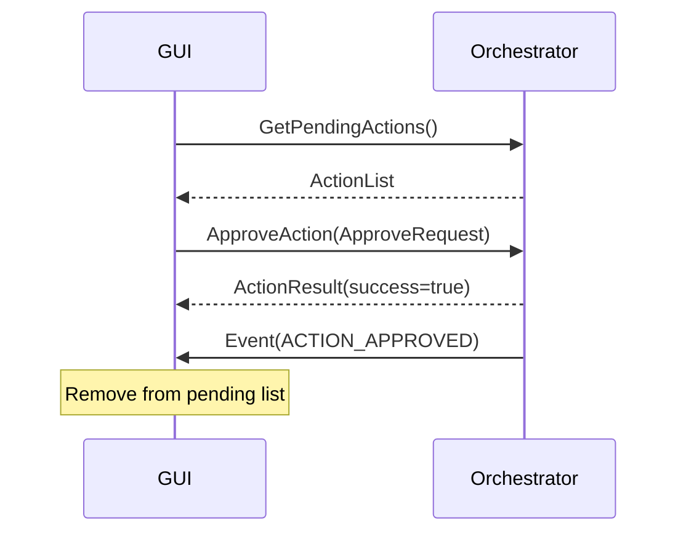
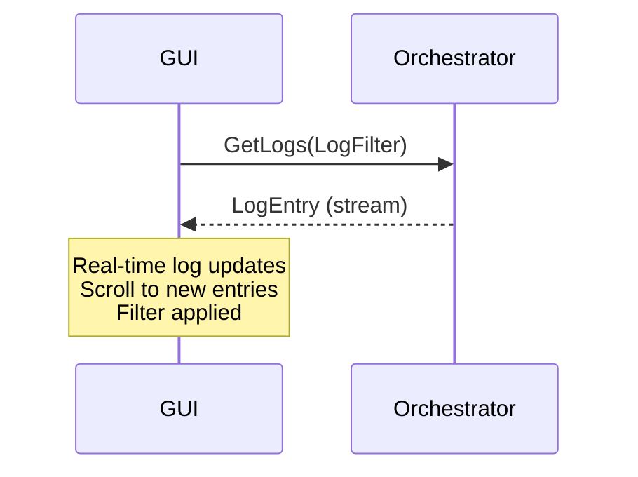

# GUI-Orchestrator IPC Specification

## Overview

The LuminaGuard GUI communicates with the Orchestrator via **gRPC over Unix Domain Sockets**. This provides type-safe, documented, and performant communication between the UI and the backend service.

## Transport

- **Protocol**: gRPC (HTTP/2 over Unix Domain Sockets)
- **Socket Path**: `/tmp/luminaguard-gui.sock` (default)
- **Socket Permissions**: 0700 (user-only read/write)
- **Serialization**: Protocol Buffers (protobuf)

## Protocol Definition

### Service Definition

```protobuf
syntax = "proto3";

package luminaguard.orchestrator;

import "google/protobuf/timestamp.proto";

// Orchestrator service for GUI communication
service Orchestrator {
    // Event streaming
    rpc SubscribeEvents (EventFilter) returns (stream Event);

    // Approval operations
    rpc GetPendingActions (Empty) returns (ActionList);
    rpc GetActionDetails (ActionId) returns (ActionDetails);
    rpc ApproveAction (ApproveRequest) returns (ActionResult);
    rpc RejectAction (RejectRequest) returns (ActionResult);
    rpc ApproveAll (ApproveAllRequest) returns (BatchActionResult);
    rpc RejectAll (RejectAllRequest) returns (BatchActionResult);

    // Log operations
    rpc GetLogs (LogFilter) returns (stream LogEntry);
    rpc GetLogRange (LogRangeRequest) returns (LogEntryList);
    rpc ExportLogs (ExportRequest) returns (ExportResult);

    // Status and metrics
    rpc GetStatus (Empty) returns (SystemStatus);
    rpc GetMetrics (MetricsFilter) returns (Metrics);
    rpc GetAgents (Empty) returns (AgentList);

    // Configuration
    rpc GetSettings (Empty) returns (Settings);
    rpc UpdateSettings (SettingsUpdate) returns (Empty);
    rpc ReloadSettings (Empty) returns (Empty);

    // Control
    rpc StartOrchestrator (Empty) returns (ControlResult);
    rpc StopOrchestrator (Empty) returns (ControlResult);
    rpc RestartOrchestrator (Empty) returns (ControlResult);
}
```

### Message Types

```protobuf
// Empty message for requests with no parameters
message Empty {}

// Event filter for subscription
message EventFilter {
    repeated EventType event_types = 1;
    repeated string source_patterns = 2;
    google.protobuf.Timestamp since = 3;
    int64 max_events = 4;
}

// Event types
enum EventType {
    UNKNOWN = 0;
    ACTION_PENDING = 1;
    ACTION_APPROVED = 2;
    ACTION_REJECTED = 3;
    LOG_ENTRY = 4;
    STATUS_UPDATE = 5;
    AGENT_CONNECTED = 6;
    AGENT_DISCONNECTED = 7;
    VM_STARTED = 8;
    VM_STOPPED = 9;
    ERROR_OCCURRED = 10;
}

// Event message
message Event {
    EventType type = 1;
    bytes payload = 2;
    google.protobuf.Timestamp timestamp = 3;
    string source = 4;
    string correlation_id = 5;
}

// Action list response
message ActionList {
    repeated Action actions = 1;
    int64 total_count = 2;
    int64 pending_count = 3;
}

// Action ID
message ActionId {
    string id = 1;
}

// Action details
message ActionDetails {
    Action action = 1;
    DiffDetails diff = 2;
    ApprovalHistory approvals = 3;
}

// Diff details
message DiffDetails {
    string file_path = 1;
    repeated DiffLine additions = 2;
    repeated DiffLine removals = 3;
    int64 old_size = 4;
    int64 new_size = 5;
}

// Diff line
message DiffLine {
    int32 line_number = 1;
    string content = 2;
    DiffType type = 3;
}

enum DiffType {
    CONTEXT = 0;
    ADDED = 1;
    REMOVED = 2;
    MODIFIED = 3;
}

// Approval history
message ApprovalHistory {
    repeated Approval approval = 1;
}

message Approval {
    string user_id = 1;
    string user_name = 2;
    bool approved = 3;
    google.protobuf.Timestamp timestamp = 4;
    string reason = 5;
}

// Approve request
message ApproveRequest {
    string action_id = 1;
    string user_id = 2;
    string comment = 3;
}

// Reject request
message RejectRequest {
    string action_id = 1;
    string user_id = 2;
    string reason = 3;
}

// Action result
message ActionResult {
    bool success = 1;
    string message = 2;
    google.protobuf.Timestamp timestamp = 3;
}

// Approve all request
message ApproveAllRequest {
    string user_id = 1;
    repeated string action_ids = 2;  // Empty = all pending
}

// Reject all request
message RejectAllRequest {
    string user_id = 1;
    repeated string action_ids = 2;  // Empty = all pending
    string reason = 3;
}

// Batch action result
message BatchActionResult {
    repeated ActionResult results = 1;
    int64 success_count = 2;
    int64 failure_count = 3;
}

// Log filter
message LogFilter {
    repeated LogLevel levels = 1;
    repeated string sources = 2;
    google.protobuf.Timestamp start_time = 3;
    google.protobuf.Timestamp end_time = 4;
    string search_query = 5;
    bool case_sensitive = 6;
    int64 max_entries = 7;
}

enum LogLevel {
    TRACE = 0;
    DEBUG = 1;
    INFO = 2;
    WARN = 3;
    ERROR = 4;
}

// Log entry
message LogEntry {
    string id = 1;
    LogLevel level = 2;
    string message = 3;
    string source = 4;
    string file_path = 5;
    int32 line_number = 6;
    google.protobuf.Timestamp timestamp = 7;
    map<string, string> metadata = 8;
}

// Log range request
message LogRangeRequest {
    google.protobuf.Timestamp start_time = 1;
    google.protobuf.Timestamp end_time = 2;
    string source = 3;
    int64 max_entries = 4;
}

// Log entry list
message LogEntryList {
    repeated LogEntry entries = 1;
    int64 total_count = 2;
    bool has_more = 3;
}

// Export request
message ExportRequest {
    LogFilter filter = 1;
    ExportFormat format = 2;
    string output_path = 3;
}

enum ExportFormat {
    JSON = 0;
    TEXT = 1;
    CSV = 2;
}

// Export result
message ExportResult {
    bool success = 1;
    string file_path = 2;
    int64 entry_count = 3;
}

// System status
message SystemStatus {
    bool orchestrator_running = 1;
    string version = 2;
    google.protobuf.Timestamp start_time = 3;
    string uptime = 4;
    string status_message = 5;
}

// Metrics filter
message MetricsFilter {
    google.protobuf.Timestamp start_time = 1;
    google.protobuf.Timestamp end_time = 2;
    repeated MetricType types = 3;
}

enum MetricType {
    CPU_USAGE = 0;
    MEMORY_USAGE = 1;
    NETWORK_IO = 2;
    DISK_IO = 3;
    REQUEST_RATE = 4;
    ERROR_RATE = 5;
    LATENCY = 6;
    VM_COUNT = 7;
}

// Metrics response
message Metrics {
    repeated MetricPoint points = 1;
    MetricSummary summary = 2;
}

message MetricPoint {
    MetricType type = 1;
    double value = 2;
    google.protobuf.Timestamp timestamp = 3;
    map<string, string> labels = 4;
}

message MetricSummary {
    map<MetricType, double> averages = 1;
    map<MetricType, double> maximums = 2;
    map<MetricType, double> minimums = 3;
    google.protobuf.Timestamp start_time = 4;
    google.protobuf.Timestamp end_time = 5;
    int64 sample_count = 5;
}

// Agent list
message AgentList {
    repeated AgentInfo agents = 1;
    int64 total_count = 2;
    int64 online_count = 3;
}

message AgentInfo {
    string id = 1;
    string role = 2;
    string hostname = 3;
    string ip_address = 4;
    uint32 port = 5;
    bool is_online = 6;
    google.protobuf.Timestamp last_seen = 7;
    int64 latency_ms = 8;
}

// Settings
message Settings {
    GeneralSettings general = 1;
    SecuritySettings security = 2;
    NetworkSettings network = 3;
    LogSettings log = 4;
    UISettings ui = 5;
}

message GeneralSettings {
    string theme = 1;
    bool auto_start = 2;
    int32 log_retention_days = 3;
    bool auto_scroll_logs = 4;
    double refresh_rate_seconds = 5;
    bool notification_sounds = 1;
    string language = 2;
}

message SecuritySettings {
    bool require_approval_file_edit = 1;
    bool require_approval_network_request = 2;
    bool require_approval_system_command = 3;
    bool require_approval_ai_tool = 4;
    bool require_password_approval = 5;
    bool mesh_encryption_enabled = 6;
    bool mesh_require_signatures = 7;
    bool mesh_forward_secrecy = 8;
    int32 approval_timeout_minutes = 9;
}

message NetworkSettings {
    string listen_address = 1;
    uint32 listen_port = 2;
    bool mesh_discovery_enabled = 3;
    string mesh_service_type = 4;
    uint32 mesh_discovery_port = 5;
    uint32 mesh_data_port = 6;
    int32 max_peers = 7;
    int64 max_message_size = 8;
    double max_upload_rate_mbps = 9;
    double max_download_rate_mbps = 10;
    string proxy_address = 11;
}

message LogSettings {
    repeated LogLevel enabled_levels = 1;
    repeated string enabled_sources = 2;
    int32 max_log_lines = 3;
    string log_format = 4;
}

message UISettings {
    string window_geometry = 1;
    int32 font_scale_percent = 2;
    bool show_tray_icon = 3;
}

// Settings update
message SettingsUpdate {
    GeneralSettings general = 1;
    SecuritySettings security = 2;
    NetworkSettings network = 3;
    LogSettings log = 4;
}

// Control result
message ControlResult {
    bool success = 1;
    string message = 2;
    google.protobuf.Timestamp timestamp = 3;
}

// Action message
message Action {
    string id = 1;
    string description = 2;
    string type = 3;
    google.protobuf.Timestamp timestamp = 4;
    string source_file = 5;
    map<string, string> metadata = 6;
}
```

## Event Flow

### Connection Setup



### Event Stream



### Approval Flow



### Log Streaming



## Error Handling

### Standard Error Response

```protobuf
message Error {
    string code = 1;
    string message = 2;
    google.protobuf.Timestamp timestamp = 3;
    string stack_trace = 4;
}

// RPCs that can fail return:
// - ActionResult (on approval failure)
// - ControlResult (on control operation failure)
// - ExportResult (on export failure)
```

### Error Codes

| Code | Description | Retryable |
|-------|-------------|------------|
| `UNKNOWN` | Unexpected error | Maybe |
| `NOT_FOUND` | Resource not found | No |
| `PERMISSION_DENIED` | Insufficient permissions | No |
| `INVALID_ARGUMENT` | Bad request parameters | No |
| `TIMEOUT` | Operation timed out | Yes |
| `ALREADY_EXISTS` | Resource already exists | No |
| `INTERNAL_ERROR` | Server-side error | Maybe |
| `SERVICE_UNAVAILABLE` | Service not ready | Yes |

### Retry Logic

```rust
// GUI-side retry
async fn call_with_retry<T, F>(
    mut call: F,
    max_retries: u32,
) -> Result<T> {
    let mut retry_count = 0;
    loop {
        match call().await {
            Ok(result) => return Ok(result),
            Err(e) if retry_count < max_retries => {
                retry_count += 1;
                tokio::time::sleep(Duration::from_millis(
                    100 * 2_u32.pow(retry_count)
                )).await;
            }
            Err(e) => return Err(e),
        }
    }
}
```

## Security

### Authentication

- **Socket Permissions**: 0700 (owner read/write only)
- **UID/GID**: Verify orchestrator process ownership
- **Connection Verification**: Accept only from local processes

### Rate Limiting

- **Event Stream**: Max 1000 events/second
- **RPC Calls**: Max 100 calls/second
- **Log Stream**: Max 10,000 entries/second

### Data Sanitization

- **File Paths**: Prevent directory traversal (`../` in paths)
- **Commands**: Validate against whitelist
- **Metadata**: Strip sensitive information

## Performance

### Latency Targets

| Operation | Target | Notes |
|-----------|--------|-------|
| Connect | <50ms | Socket establishment |
| RPC Call | <100ms | Simple queries |
| Event Stream | <10ms | Per event delivery |
| Log Stream | <50ms | Per log entry |
| Approval | <200ms | Action execution |

### Memory Targets

- **GUI Process**: <100MB RSS
- **Event Buffer**: Max 10MB (circular)
- **Log Cache**: Max 50MB (LRU)

## Implementation Notes

### GUI Client (Rust)

```rust
// orchestrator/src/gui/ipc/client.rs
use tonic::transport::Endpoint;
use tonic::transport::channel;
use tokio::net::UnixStream;

pub struct GuiClient {
    client: OrchestratorClient<Channel>,
}

impl GuiClient {
    pub async fn connect(socket_path: &str) -> Result<Self> {
        let channel = Endpoint::try_from("unix://".to_string() + socket_path)?
            .connect_with_connector(stream_connector)?;

        let client = OrchestratorClient::new(channel);
        Ok(Self { client })
    }

    pub async fn subscribe_events(
        &self,
        filter: EventFilter,
    ) -> Result<tonic::Streaming<Event>> {
        Ok(self.client.subscribe_events(filter).await?.into_inner())
    }
}
```

### Orchestrator Server

```rust
// orchestrator/src/ipc/server.rs
use tokio::net::UnixListener;
use tonic::transport::Server;

pub struct IpcServer {
    event_broadcast: tokio::sync::broadcast::Sender<Event>,
}

impl IpcServer {
    pub async fn serve(&self, socket_path: &str) -> Result<()> {
        // Remove existing socket
        std::fs::remove_file(socket_path).ok();

        let listener = UnixListener::bind(socket_path)?;

        Server::builder()
            .add_service(OrchestratorServer::new(self.event_broadcast))
            .serve_with_incoming(listener)
            .await?;

        Ok(())
    }

    pub async fn broadcast_event(&self, event: Event) {
        let _ = self.event_broadcast.send(event);
    }
}
```

## Testing

### Unit Tests

- **Message Serialization**: Verify protobuf encode/decode
- **Filter Logic**: Test all filter combinations
- **Error Cases**: Verify proper error responses

### Integration Tests

- **Full Round Trip**: Connect -> Subscribe -> Verify events
- **Stress Test**: 10,000 events/second for 60 seconds
- **Recovery**: Disconnect -> Reconnect -> Verify state sync
